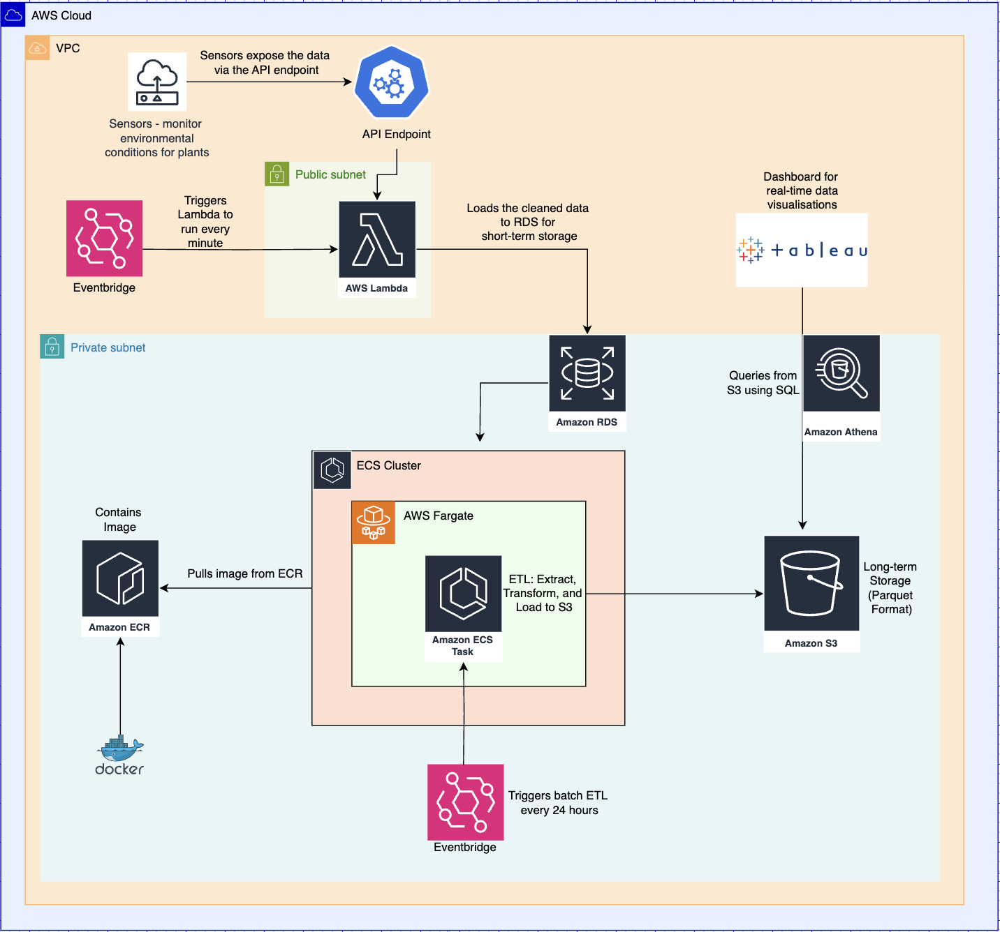
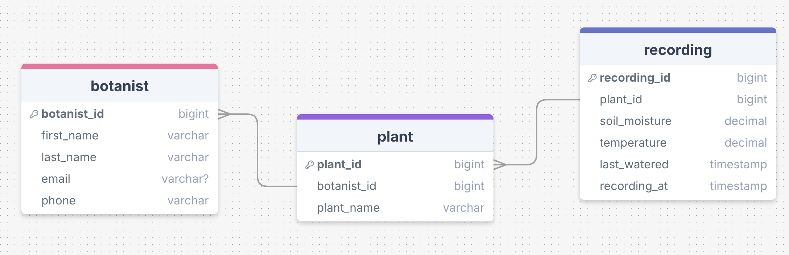
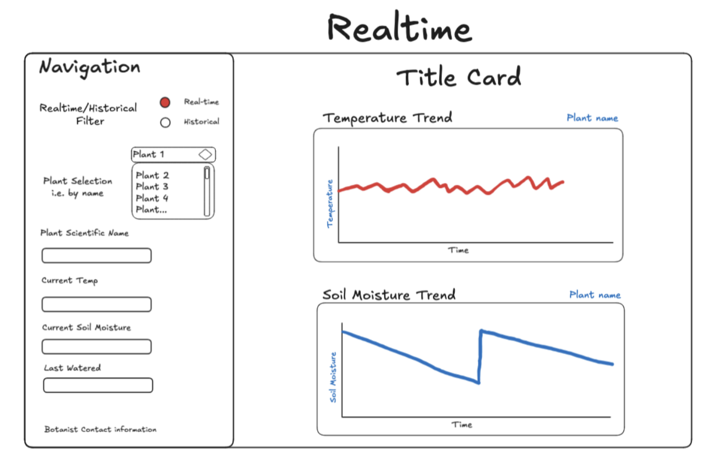

# Liverpool Natural History Museum Plant Monitoring Project

## Overview
The Liverpool Natural History Museum (LNMH) has introduced a new botanical wing and requires a robust solution to monitor the health of their plants housed in their conservatory. This project implements a cloud-based ETL pipeline and visualisation solution to monitor plant health metrics, including soil moisture and temperature, collected from sensors connected to Raspberry Pi devices.

This solution enables:
- Real-time monitoring of plant health.
- A short-term database to store readings from the last 24 hours.
- A long-term storage solution for historical data.
- A dashboard for visualising real-time and historical trends.

---

## Project Architecture

The architecture comprises:
1. **Sensors and Raspberry Pi**: Collect data and expose it via an API.
2. **AWS Lambda and RDS**: Short-term storage for the last 24 hours of data.
3. **ECS and S3**: Batch ETL processes to transfer older data to long-term storage.
4. **Streamlit Dashboard**: Real-time and historical visualisation of plant data.

---

## Deliverables

### Extract
- Data is retrieved from an API endpoint for each plant (approx. 50 plants) every minute.
- Faulty data is identified and excluded during transformation.

### Transform
- Data is cleaned and verified.
- Plant-related metrics and metadata are normalised and stored in a relational database (RDS).

### Load
#### Short-Term Storage
- **Amazon RDS**: Stores only the most recent 24 hours of data.

#### Long-Term Storage
- **Amazon S3**: Cost-efficient long-term storage in Parquet format.

---

## Visualisation
- **Streamlit**: Interactive dashboard for real-time monitoring and trend analysis of plant health metrics.
  - View graphs of temperature and soil moisture readings for all plants.
  - Query historical data from S3.

---

## Tech 
The following technologies were used:
- **Infrastructure**: Terraform for provisioning.
- **Containers**: Docker for running all services.
- **Cloud Hosting**: AWS.
- **Database**: Microsoft SQL Server (RDS).
- **Data Visualisation**: Streamlit.
- **Programming Language**: Python.

---

## Project Files

- **ETL Pipelines**:
  - [Pipeline README (Short-term storage API-RDS)](./pipeline/README.md)
  - [Pipeline README (Long-term storage RDS-S3)](./rds_to_s3_pipeline/README.md)
- **Terraform**:
  - [Terraform README](./terraform/README.md)
- **Streamlit Dashboard**:
  - [Dashboard README](./dashboard/README.md)

---

## ERD (Entity Relationship Diagram)

---

## Assumptions
- One botanist can be in charge of multiple plants, but only one plant can have one botanist.
- The origin location of the plant doesn't have a direct relationship to how healthy it is. 
- The long-term storage solution (S3) is designed for scalability and low cost.

## Running the Project

1. **Infrastructure Setup**:
   - Navigate to the `terraform` folder and follow the [Terraform README](./terraform/README.md) to provision resources.

2. **ETL Pipeline**:
   - Set up the ETL pipeline by running the scripts located in the `pipeline` folder. Detailed instructions are available in the respective READMEs.

3. **Dashboard**:
   - Deploy the Streamlit dashboard by following the [Dashboard README](./dashboard/README.md).

---

## Wireframe Design
 (images/dashboard_wireframe_historical.png)

## Assumptions
- Botanist contact information (e.g., email, phone number) is intentionally excluded from the historical data dashboard. This ensures that if a botanist leaves the institute, their personal data will not persist on the dashboard, maintaining privacy and security.

---

## Future Improvements
1. Mobile App Integration
   - Create a mobile application for on-the-go monitoring of plant health metrics.
   - Include push notifications for critical alerts (e.g., low soil moisture, extreme temperatures).

2. Expanded Visualisation Features
   - Add comparison graphs to analyse multiple plants simultaneously.
   - Include dynamic filters for customisable visualisation views (e.g., by botanist, plant species, or section of the conservatory).

3. Real-Time Notifications
   - Implement SMS, email notifications for real-time alerts on critical readings.

4. Historical Data Enrichment
   - Include additional metadata for plants, such as origin, species-specific needs, and growth patterns.

5. Object-Oriented Programming (OOP) Integration
   - Future iterations could explore using OOP principles, treating entities such as plants and botanists as objects. This would provide a more modular and scalable codebase, improving maintainability and readability.

Why OOP was not Used in This Attempt:

- Simpler Implementation Needs: For the initial phase, the project’s requirements were straightforward, and procedural programming provided a faster and more direct approach.
- Time Constraints: Implementing OOP requires additional time for designing and structuring classes, which was not feasible given the project timeline.
- Data Size and Complexity: The current scale and complexity of the data did not necessitate the use of OOP. As the project evolves, and the system handles more complex interactions, OOP could become more beneficial.
