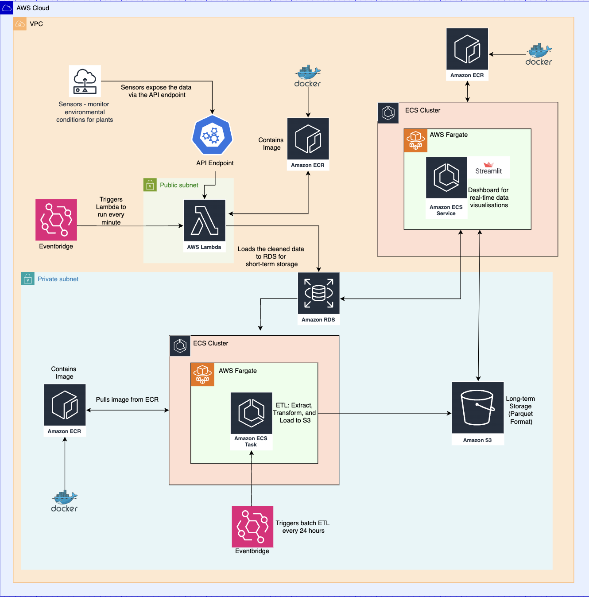

## Assumptions
1. One botanist can be in charge of multiple plants, but only one plant can have one botanist
2. The origin location of the plant doesn't have a direct relationship to how healthy it is 